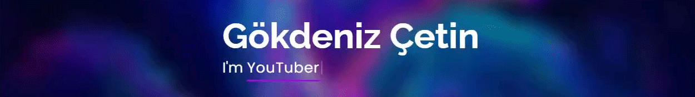

<!-- PROFILE LOGO -->
 

  

  <h3 align="center">Gökdeniz Çetin</h3>

  

    Innovative and deadline-driven Motion Graphics Designer with 3+ years of experience animating material from final illustration and UI/UX design from initial concept to polished final version.
	 
	 
	Founder CEO of <a href="https://tenharstudios.wordpress.com">Tenhar Studios</a>.
	
     
	 
	<a href="https://www.paypal.com/donate?hosted_button_id=Z37EHTDSQG7D4">💰 Support me on PayPal</a>
    ·
	<a href="https://dryrel.itch.io">🎮 Download Games</a>
    ·
    <a href="mailto:contact@gokdenizcetin.com">🔴 Report Bug</a>
	 
	 
    <a href="https://steamcommunity.com/id/DryreL/">Steam</a>
	·
    <a href="https://youtube.com/c/DryreL">YouTube</a>
	·
	<a href="https://twitch.tv/DryreL">Twitch</a>
	·
	<a href="https://fiverr/DryreL/">Fiverr</a>
	·
    <a href="https://behance.net/DryreL" class=">Behance</a>
	·
	<a href="https://deviantart.com/dryrel">Deviantart</a>

- 👦🏻 Hi, I’m <a href="#">@DryreL</a>
- 💻 I’m currently developing games
- 💜 I’m looking to collaborate with talented artists
- 📧 Contact: contact@gokdenizcetin.com

  

<!---
DryreL/DryreL is a ✨ special ✨ repository because its `README.md` (this file) appears on your GitHub profile.
You can click the Preview link to take a look at your changes.
--->
