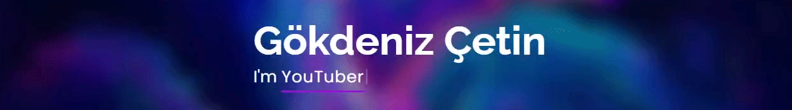

<!-- PROFILE LOGO -->
 
<!---

  
--->

  <!-- <h3 align="center">Gökdeniz Çetin</h3> -->

  

    Innovative and deadline-driven Game Developer with 5+ years of experience within UI/UX design that covers design from initial concept to polished final version and animating graphics, functional menus.
	 
	 
	Gökdeniz Çetin <a href="https://gokdenizcetin.com">Personal Website</a>
	 
	 
	<a href="https://www.paypal.com/donate?hosted_button_id=Z37EHTDSQG7D4">💰 Support me on PayPal</a>
    ·
	<a href="https://dryrel.itch.io">🎮 Download Games</a>
    ·
    <a href="mailto:contact@gokdenizcetin.com">🔴 Report Bug</a>
	 
	 

- 👦🏻 Hi, I’m <a href="#">@DryreL</a>
- 💻 I’m currently developing games and creating advanced UIs
- ⭐️ Social: <a href="https://steamcommunity.com/id/DryreL/">Steam</a> - <a href="https://youtube.com/c/DryreL">YouTube</a> - <a href="https://twitch.tv/DryreL">Twitch</a> - <a href="https://fiverr/DryreL/">Fiverr</a> - <a href="https://behance.net/DryreL">Behance</a> - <a href="https://deviantart.com/dryrel">DeviantArt</a>
- 📧 E-Mail: contact@gokdenizcetin.com

  

<!---
DryreL/DryreL is a ✨ special ✨ repository because its `README.md` (this file) appears on your GitHub profile.
You can click the Preview link to take a look at your changes.
--->
